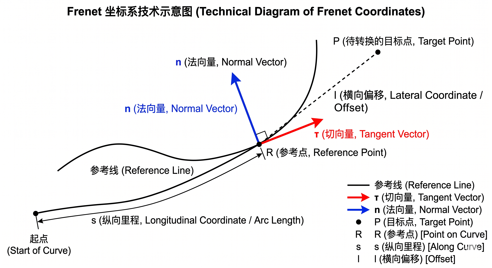

# 记录一下笛卡尔与 Frenet 坐标系的双向转换实现

## 一、我为什么需要这个模块

我的规划器里有一条参考线（用 Spline2D 拟合出来的），我需要在上面做规划。然后就遇到了一个问题：障碍物的坐标是笛卡尔的 (x, y)，但我规划的时候用的是 Frenet 坐标 (s, l)——因为 Frenet 下纵横向是解耦的，规划简单得多。

所以我需要一个模块，能在这两个坐标系之间来回转换：

- **笛卡尔 → Frenet**：把障碍物投影到参考线上，得到 (s, l)
- **Frenet → 笛卡尔**：把我规划出来的轨迹点 (s, l) 转回世界坐标，给控制器用

我刚开始的时候完全不懂 Frenet 是什么，后来翻 Werling 的论文看了一遍，再结合 Apollo 的源码，才把这两条路走通。这篇文章记录一下我的理解过程。

---

## 二、源码位置

> **仓库：** [https://github.com/gj-465930/ros2-pnc-planner](https://github.com/gj-465930/ros2-pnc-planner)
>
> - 头文件：`src/pnc_planner/include/pnc_planner/math/cartesian_frenet.hpp`
> - 实现：`src/pnc_planner/src/math/cartesian_frenet.cpp`
> - 调用入口：`src/pnc_planner/src/reference_line.cpp` 的 `ReferenceLine::getFrenetPoint()`

---

## 三、先把数学搞清楚



### 3.1 什么是 Frenet 坐标

参考线上每一个点 R，都可以用弧长 s 来定位。在 R 处可以定义一对正交向量：

- **切向量 τ**：沿着参考线的方向。如果参考线在 s 处的航向角是 θ，那么 `τ = (cos θ, sin θ)`
- **法向量 n**：垂直于 τ，指向参考线左侧。`n = (-sin θ, cos θ)`

现在平面上任意一点 P，我就可以用两个量来描述它：

```
P = R(s) + l * n(s)
```

展开：

```
x = x_ref(s) + l * (-sin θ)
y = y_ref(s) + l * (cos θ)
```

- `s`：P 沿着参考线的投影位置（走了多远）
- `l`：P 偏离参考线的距离，左正右负

这就是 Frenet 坐标 `(s, l)` 的定义。上面这个展开式其实也就是 **Frenet → 笛卡尔** 的转换公式——有 s 有 l，直接代进去就出 (x, y)。

对应到我的代码，`frenetToCartesian` 做的事情就是这个公式（`cartesian_frenet.cpp` 第 70-92 行）：

```cpp
double nor_x = -tau_y;   // 法向量 x 分量
double nor_y = tau_x;    // 法向量 y 分量

x = ref_x + l * nor_x;
y = ref_y + l * nor_y;
```

---

### 3.2 反过来就麻烦了：笛卡尔 → Frenet

Frenet → 笛卡尔有闭式解，一行公式搞定。但 **笛卡尔 → Frenet** 没有解析解——给定 (x, y)，要在参考线上找一个 s，使得 R(s) 到 P 的连线垂直于参考线。这就是**找垂足**的问题。

用数学描述的话，我在求解：

```
写清楚点：我要求一个 s，使得参考线上点 R(s) 到目标点 P 的距离最小。

这个距离平方记作 f(s)：

  f(s) = (x_ref(s) - x)² + (y_ref(s) - y)²

我的目标就是 min f(s)，让 f(s) 取到最小值时的 s 就是我要的投影点。
```

f(s) 是参考线坐标 x_ref(s)、y_ref(s) 的函数——而这两条曲线是我用 Spline1D 插出来的三次多项式，所以 f(s) 是个相当复杂的函数。求导令其为零去解 s？不现实。

我参考了 Apollo 的做法，用了**多分辨率网格搜索**：先用大步长在整条参考线上扫一遍，找到最近点的大致位置，然后逐步缩小搜索范围和步长，精确定位。

```
第 1 轮：步长 1m  → 整条参考线粗搜，缩小到 ±2m 范围
第 2 轮：步长 0.1m → 在 ±2m 内搜，缩小到 ±0.2m 范围
第 3 轮：步长 0.01m → 在 ±0.2m 内搜，精度到厘米级
```

我的代码里是用一个 steps 数组来控制三级分辨率的（`cartesian_frenet.cpp` 第 22 行）：

```cpp
std::vector<double> steps = {1.0, 0.1, 0.01};
```

然后一个外层循环逐级搜：

```cpp
for (double step : steps) {
    double curr_best_s = best_s;
    for (double curr_s = search_start; curr_s <= search_end; curr_s += step) {
        eval_func(curr_s, temp_x, temp_y, temp_heading);
        double dist_sq = (temp_x - target_x)² + (temp_y - target_y)²;
        if (dist_sq < min_dist_sq) {
            min_dist_sq = dist_sq;
            curr_best_s = curr_s;
        }
    }
    best_s = curr_best_s;
    search_start = max(0.0, best_s - 2 * step);
    search_end   = min(max_s, best_s + 2 * step);
}
```

每一轮搜完，我以找到的最佳点为中心，±2 倍当前步长作为下一轮的搜索区间。这样既不用全范围 0.01m 暴力搜（对 100m 参考线那可是一万次采样），又能保证最终精度。

---

### 3.3 怎么判断 P 在参考线的左边还是右边

上面搜出来的 s 只是纵向位置，但 l 的正负还没定。P 到参考线的距离知道，但它在左边（l > 0）还是右边（l < 0）？

我用**切向量和位移向量的叉积**来判断：

```
cross = τ_x * (y_P - y_R) - τ_y * (x_P - x_R)

cross > 0 → P 在参考线左侧 → l 为正
cross < 0 → P 在参考线右侧 → l 为负
```

怎么记？右手定则：τ 指向前方，右手四指从 τ 扫向位移向量，拇指朝上（Z+）就是左侧。

对应代码（`cartesian_frenet.cpp` 第 56-66 行）：

```cpp
double tau_x = std::cos(ref_heading);
double tau_y = std::sin(ref_heading);

double dx = target_x - ref_x;
double dy = target_y - ref_y;

double distance = std::sqrt(min_dist_sq);
double cross_product = tau_x * dy - tau_y * dx;

l = (cross_product > 0) ? distance : -distance;
```

---

## 四、模块设计上我学到了一个技巧

转换逻辑不应该绑定具体曲线类。以后参考线不用 Spline2D 了，换成贝塞尔或者多项式，转换代码不应该跟着改。

所以 `CartesianFrenetConverter` 不接收曲线对象，而是通过一个 `std::function` 回调来获取参考线的信息：

```cpp
using EvaluateCurveFunc =
    std::function<void(double s, double &x, double &y, double &heading)>;
```

只要求调用方告诉它：给定 s，参考线上那一点的 x、y、航向角是多少。具体这个信息怎么来的（Spline1D 还是别的），它不关心。

在 `ReferenceLine::getFrenetPoint` 里我是这么传的：

```cpp
auto eval_func = [this](double s, double &x, double &y, double &heading) {
    WayPoint wp = this->getWayPoint(s);
    x = wp.x;
    y = wp.y;
    heading = wp.heading;
};
return math::CartesianFrenetConverter::cartesianToFrenet(
    x, y, length_, eval_func, s, l);
```

Lambda 把 `this` 捕获进来，内部调自己的 `getWayPoint` 填好三个值。转换器完全不知道后面有个 Spline2D。

---

## 五、两个方向汇总

| 方向            | 方法                | 难度 | 做法                                       |
| --------------- | ------------------- | ---- | ------------------------------------------ |
| Frenet → 笛卡尔 | `frenetToCartesian` | 简单 | `P = R(s) + l * n(s)` 直接算               |
| 笛卡尔 → Frenet | `cartesianToFrenet` | 较难 | 多分辨率网格搜(1m→0.1m→0.01m) + 叉积定正负 |

---

## 六、一个小坑

网格搜索里我写了 `for (double curr_s = start; curr_s <= end; curr_s += step)`。这个写法在步长很小、距离很长的时候，浮点累加会有误差（300m 参考线用 0.01m 步长是 3 万次加法）。

严谨的写法是用整数索引：

```cpp
int n = static_cast<int>((end - start) / step);
for (int i = 0; i <= n; ++i) {
    double curr_s = start + i * step;
    // ...
}
```

目前我的参考线段不是很长，暂时没出问题，但这个细节我先记下了。

---

## 七、总结

回头看这个模块，核心其实就两件事：

- `(s, l) → (x, y)` 是套公式，一行搞定
- `(x, y) → (s, l)` 是找垂足——多分辨率网格搜索逼近，叉积判侧

用 `std::function` 把曲线求值逻辑和转换逻辑拆开，以后换底层实现也不会牵扯到这一块。

搞懂这个模块之后，我对规划器后面的纵横向解耦也有信心了——毕竟投影这一步是整个 Frenet 规划管道的入口。
