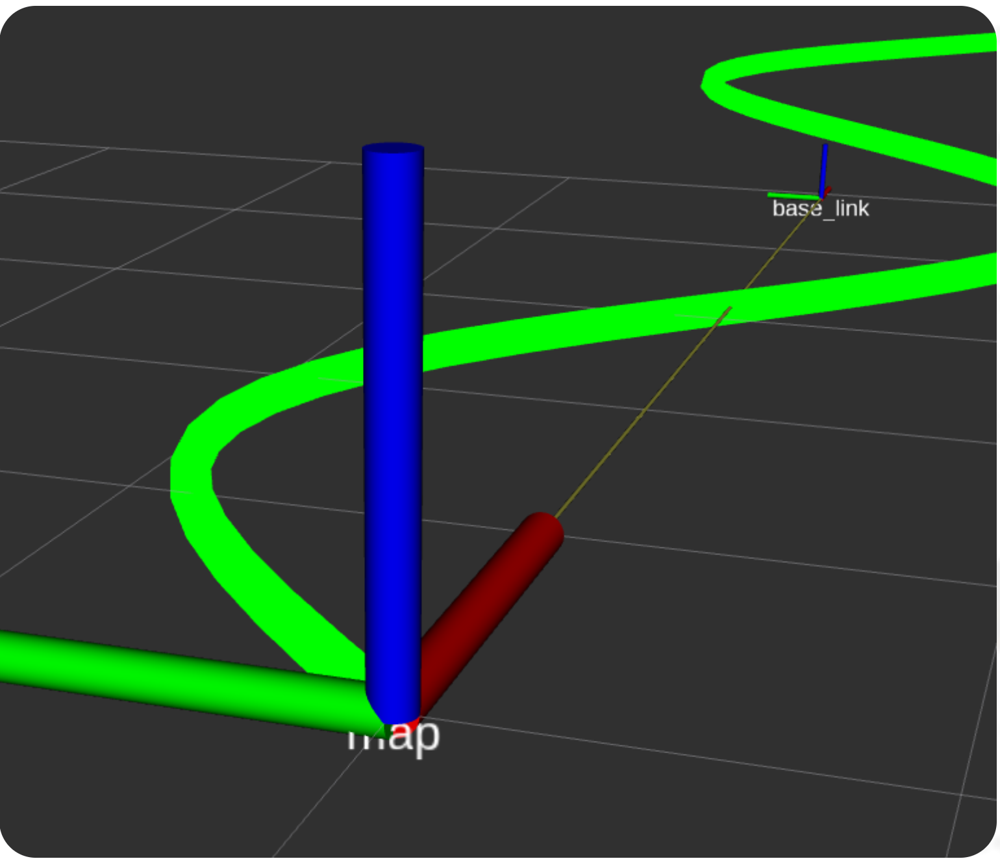

# ROS2 + EM Planner 开发记录（二）：EgoVehicle 模块

> 项目仓库：[github.com/gj-465930/ros2-pnc-planner](https://github.com/gj-465930/ros2-pnc-planner)

---

## 1. 模块流程

EgoVehicle 是自车在代码里的代理，负责三件事：存位姿 → 执行运动学 → 广播 TF。



### 文件依赖关系

```
common.hpp            ← 所有模块共享的类型定义
   │
ego_vehicle.hpp       ← 声明接口（不继承 Node）
   │
ego_vehicle.cpp       ← 运动学积分 + TF 广播
   │
main.cpp              ← 定时器驱动，周期性调 updateState
```

### 数据流

```
main 定时器 50Hz
  │
  └→ ego.updateState(dt)
       ├─ 从 vehicle_info_ 读取 v、omega、当前位姿
       ├─ 自行车模型积分：x, y, yaw 更新
       ├─ yaw → 四元数转换
       ├─ 更新状态机（STANDBY ↔ CRUISING）
       └─ broadcaster_.sendTransform(...) → /tf
```

### 和 Visualizer 一样不继承 Node

Visualizer 拿 node 指针干活，EgoVehicle 也一样。一个进程只有一个 ROS 节点，所有模块挂上面。后面 FrenetConverter、DpPlanner 也是这个模式。

### main.cpp 当前做的事

```cpp
// 画参考线（静态，发一次）
vis.publishReferenceLine(reference_points);

// 设置自车初态 + 指令
ego.setPose(0.0, 0.0, 0.0);
ego.setCommand(0.7, 0.0);  // 沿着x轴直走

// 50Hz 定时器驱动
auto timer = node->create_wall_timer(20ms, [&]() {
    ego.updateState(0.02);
});
```

---

## 2. Pose 和 VehicleInfo 的解耦

### 为什么要拆两个结构体

刚开始想把所有字段塞一起：

```cpp
// 不拆的写法（不好）
struct VehicleState {
    double x, y, yaw;   // 位姿
    double v, omega;     // 速度
    StateEnum state;     // 状态
};
```

问题：位姿信息（x, y, yaw）不止 EgoVehicle 要用——规划器要知道自车在哪，控制器要知道跟轨迹的偏差，后面感知模块也要用。每次都传整个 VehicleState 进去？太重了。

### 解耦设计

```cpp
// 纯位姿 — 轻量，到处都能用
struct Pose {
    double x = 0.0;
    double y = 0.0;
    double yaw = 0.0;
};

// 车辆完整状态 — 只有 EgoVehicle 内部关心
struct VehicleInfo {
    Pose pose;
    double v = 0.0;
    double omega = 0.0;
    VehicleState current_state = VehicleState::INIT;
};
```

这样后面规划器只需要 `Pose`，不用关心速度字段。控制模块给 EgoVehicle 发指令只需要调 `setCommand(v, omega)`，不用关心状态机内部怎么转。

### 状态机设计

```cpp
enum class VehicleState : uint8_t {
    INIT = 0,
    STANDBY = 1,
    CRUISING = 2,
    EMERGENCY = 3
};
```

用 `uint8_t` 做底层类型，省内存，跨模块传参也安全。当前 auto 转换逻辑：

```
|v| < 0.01  → STANDBY  （静止）
|v| >= 0.01 → CRUISING （行驶中）
```

后面 EMERGENCY 由控制器触发，比如偏离参考线太远就停车。

---

## 3. 踩坑：四元数默认值与 RViz2 显示异常

### 问题

RViz2 中添加 TF 显示后，`base_link` 坐标系的朝向一直在跳动，或者干脆不显示。

### 排查过程

TF 发布逻辑中，先构造了 `geometry_msgs::msg::TransformStamped`：

```cpp
geometry_msgs::msg::TransformStamped transform;

transform.header.frame_id = "map";
transform.child_frame_id = "base_link";
transform.transform.translation.x = vehicle_info_.pose.x;
transform.transform.translation.y = vehicle_info_.pose.y;
```

由于编译和运行都没有报错，**错误地以为 `transform.transform.rotation` 的四个分量有默认值（即单位四元数 w=1）**。

### 根因

查了 ROS2 源码发现，`geometry_msgs/msg/Quaternion` 的消息定义中，所有四个分量的默认值都是 `0.0`：

| 分量 | 以为的默认值 | 实际的默认值 |
| ---- | ------------ | ------------ |
| x    | 0            | 0            |
| y    | 0            | 0            |
| z    | 0            | 0            |
| w    | 1            | **0**        |

四个分量全为 0 不是有效四元数（模长不为 1），RViz2 解析这个无效旋转时行为未定义，导致显示异常。

### 修复

在发布之前，显式用 `tf2::Quaternion` 计算旋转并逐分量填入：

```cpp
tf2::Quaternion qtn;
qtn.setRPY(0.0, 0.0, vehicle_info_.pose.yaw);

transform.transform.rotation.x = qtn.getX();
transform.transform.rotation.y = qtn.getY();
transform.transform.rotation.z = qtn.getZ();
transform.transform.rotation.w = qtn.getW();
```

之后 RViz2 正常显示 `base_link` 坐标系。

ROS2 消息的默认值不一定是"合理值"。`Quaternion` 默认不是单位四元数，`Point` 默认不是 NaN。涉及数学上有约束的类型，一定要显式赋值，不要依赖默认值。

---

## 下一步：参考线生成 + 纯跟踪控制器

当前自车以恒定 v 和 omega 运动，完全忽视参考线。下一步两个模块：

- **参考线生成器（ReferenceLine）**：用几个路点 + 三次样条插值，把 `std::sin` 换掉，画出真正的车道中心线
- **纯跟踪控制器（PurePursuit）**：读取参考线 + 当前车位姿 → 计算前视距离和转向角 → 调 `ego.setCommand(v, omega)`，让车真正沿参考线跑

做完这两个模块后，自车不再是直线或画圈，而是能跟随任意参考线。跑通后实现 Frenet 坐标系转换，最终集成 EM Planner 的 DP 路径规划。

---

## 本次提交

```bash
git commit -m "feat: EgoVehicle模块，自行车模型+TF广播+状态机+Pose/VehicleInfo解耦"
```

GitHub 链接：[github.com/gj-465930/ros2-pnc-planner](https://github.com/gj-465930/ros2-pnc-planner)
